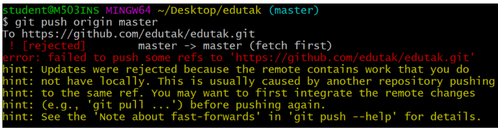

# 깃 28일 강의 복습 
## 깃의 원격 저장소의 활용 
- `Push` 와 `Pull`을 이용하여 원격저장소를 활용할 수 있다.
    - `Push` 는 로컬 저장소의 버전을 원격저장소로 보낸다
    - `Pull` 은 원격 저장소의 버전을 로컬저장소로 가져온다

- 초기 원격저장소의 설정이 필요하다.
    ```python
    $ git remote add origin https://github.com/'username'/'repositoryname'.git
    # $ git remote -v 통해 원격저장소 정보 확인이 가능하다
    ```
## Push
```python
$ git push <원격저장소이름><브랜치이름>
#로컬 저장소의 변경사항(커밋)을 원격 저장소에 올린다
```
## Pull
```python
$ git pull <원격저장소이름><브랜치이름>
#원격 저장소로부터 변경된내역을 로컬저장소에 받아온다
```

### Push Conflict
- 로컬에서의 변경사항을 Push 하고싶은데 다른 작업자가 커밋을 해 `원격저장소의 커밋 이력이 다를 경우` 발생

 

`해결방안` = 이 경우 원격저장소의 커밋을 `pull`로 가져와 로컬에서 커밋을 병합한 후 Push 한다.

## gitignore
- Git은 버전관리 시스템 but 모든 파일이 버전관리와 관련 있는 것은 아니다.

    => `.gitignore`파일을 만든 후 해당 내용들을 관리 한다.
- 이미 커밋된 파일의 경우 `삭제`를 해야 .gitignore 적용이 가능하다  

- 다음 사이트등에서 .gitignore에 일반적으로 어떤 파일들이 있는지 확인할 수 있다.
    - [개발언어](https://github.com/github/gitignore)
    - [개발환경](https://www.toptal.com/developers/gitignore/)
